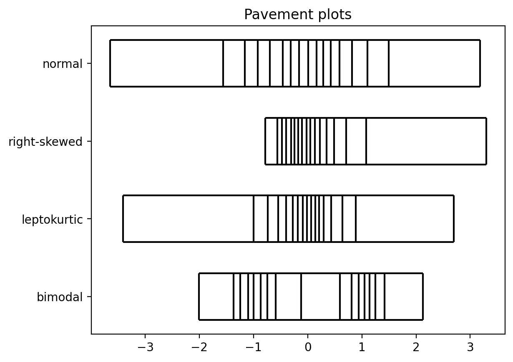

# Pavement plots

Quantile-based pavement plots with matplotlib. Every box contains an
equal share of the data.

See more in the [demo notebook](examples/demo.ipynb).

## Install

    pip install pavement

## Usage

    import pavement
    pavement.plot([1, 2, 3, 4, 5])

## Tests

    pip install -e '.[test]'
    pytest
